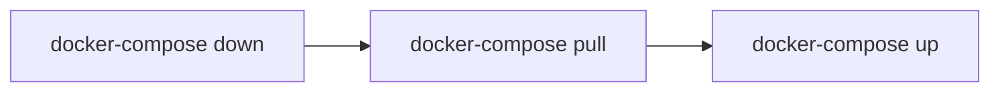

# Proyectos utilizando Docker
Este repositorio te permitirá lanzar la aplicación web del proyecto Vecinos utilizando la tecnología de contendores Docker. La imagen de Django que utiliza este proyecto esta alojada en GitHub y es necesario tener permisos de lectura a la propia imagen. La base datos que está configurada por defecto es PostgreSQL y se utiliza un volumen para la persistencia de los datos introducidos en la base datos.

Si necesitas incluir algún paquete de Python en la imagen de Django escribe a [diego@enoges.es](mailto:diego@enoges.es) o en el canal de Slack correspondiente a este proyecto.

**Nota:** este proyecto está pensado y probado para hosts Linux, no se ha pensado ni probado para Docker corriendo en Windows.

## Configurando Docker y Django

### Configuracion del stack de Docker
Lo primero que tenemos que hacer es configura el archivo _.env_ del proyecto, en el cual encontraras las siguientes variables:

Variable | Descripción
--- | ---
UID=1000 | Usuario en el Linux host que lanza el stack de Oxysana
GID=100 | Grupo en el Linux host que lanza el stack de Oxysana
WEBPORT=8002 | Puerto expuesto para la web de Django
DBNAME=DB | Nombre de la base datos de PostgreSQL
DBUSER=User | Usuario para la base datos de PostgreSQL
DBPASSWD=Password | Contraseña para la base de datos de PostgreSQL
DBPORT=5435 | Puerto expuesto para el acceso a la base datos.

En las variables de UID y de GID tendrás que introducir los correspondientes a tu usuario de Linux. Para obtener los valores de tu actua usuario simplemente ejecutamos el siguiente comando:
```
id
```
y tendremos un resultado parecido a este:

`uid=1000(user) gid=1000(users) groups=1000(users),998(docker)`

En este caso, escribiremos en el **_.env_** 1000 para el UID y 1000 para el GID.

Los otros campos se pueden configurar más libremente, pero teniendo cuidado con los puertos y los posibles conflictos que pueda haber con el propio sistema operativo y los servicios del mismo.

Clonamos el repositorio y renombramos la carpeta con el proyecto a _app_ con el siguiente comando.

```
git clone https://github.com/Applica2/oxysana.git && mv ./oxysana ./app
```
### local_settings de Django
Nos queda configurar los datos de conexión a la base datos que vamos a utilizar en Django, en este caso es PostgreSQL, y la ruta de los archivos estáticos.

Para ello vamos hasta la ruta de configuración del proyecto de Django, en este caso sería _./app/oxysana_, creamos un archivo con el siguiente nombre **local_settings.py** y añadimos los datos correspondientes a los datos de conexion que hayas introducido en el archivo **_.env_**.

En el apartado de **HOST** ponemos el nombre de la maquina desde la cual se ejecuta el docker. Es la parte que viene despues del @, diego@**devel**:~$

```
DATABASES = {
    'default': {
        'ENGINE': 'django.db.backends.postgresql',
        'NAME': 'DB',
        'USER': 'User',
        'PASSWORD': 'Password',
        'HOST': 'devel',
        'PORT': 5435,
    }
}

STATIC_URL = '/static/'

STATICFILES_DIRS = [
    'static'
]
```
Esta configuración es exclusiva de tu desarrollo y no se sube a GitHub.

## Levantando el proyecto por primera vez
Una vez terminada la configuración anterior ya podemos levantar el proyecto por primera vez.
Lo haremos desde la carpeta donde está el archivo _docker-compose.yml_ ejecutando el siguiente comando:

```
docker-compose up
```
No agregamos la opción `-d ` -detach- para poder ver la salida del log y así poder ver los posibles errores de ejecución que tengamos.

Para parar la ejecución del stack pulsaremos la combinación de teclas **Ctrl + c** en la terminal donde estamos viendo la salida del log. En caso de no tener la terminal abierta o haber utilizado la opción `-d ` pararemos la ejecución con:

```
docker-compose stop
```

## Comando utiles de docker
Los siguientes comandos **siempre** tendrán que ser ejecutados donde se encuentre el archivo _docker-compose.yml_ de nuestro proyecto.

Script | Descripción
--- | ---
`docker-compose up` | crea y lanza el stack del proyecto, ocupando la salida de la terminal para ver errores de ejecución en los contenedores
`docker-compose up -d` | crea y lanza el stack del proyecto sin mostrar la salida de los logs de los contenedores
`docker-compose stop` | para la ejecución de los contenedores del stack
`docker-compose restart` | para y lanza nuevamente los contenedores del stack
`docker-compose down` | para y elimina los contenedores del stack. No se borran los volumenes de datos.
`docker-compose pull` | actualiza la imagen en la que se basan los contenedores.

Ejemplo práctico: después de pedir que se añada un paquete de Python a la imagen de Django el flujo acciones sería el siguiente para poder hacer uso de la nueva imagen generada:



## Scripts útiles

Con los siguientes scripts podrás ejecutar de una forma sencilla las principales acciones de Django

Script | Descripción
--- | ---
`start-project.sh` | comienza un nuevo proyecto, necesita el nombre del proyecto
`start-app.sh` | crea la estructura de una nueva app, necesita el nombre de la appa
`collectstatics.sh` | recoge todos los estáticos y los mueve a la carpeta correspondiente
`make-migrations.sh` | se encarga de procesar los cambios y ejecutarlos contra la base de datos

## Contacto
Cualquier duda que tengas o error que encuentres, escribe a [diego@enoges.es](mailto:diego@enoges.es) o en el canal de Slack correspondiente a este proyecto.
